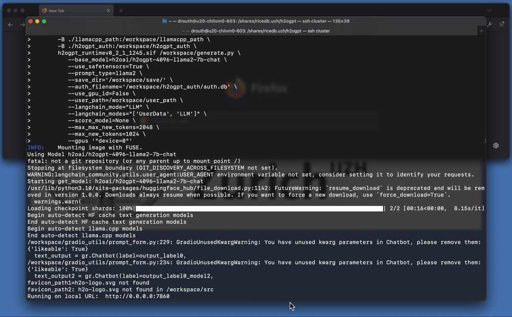

# RiceDB

## Running a GPT with a Retrieval Augmented Generation Framework (RAG)

There are principally two methods by which one would run an open source GPT with RAG functionality:

1. Interactively: to have a "chat" experience and to fully explore a GPT framework.
2. Programmatically: to batch process a large series of prompts and receive responses efficiently. (Still under development!)

We present code for both options to run [H2OGPT](https://github.com/h2oai/h2ogpt) via a [Singularity](https://docs.sylabs.io/guides/latest/user-guide/) container. Singularity was chosen as it is a academic and industry standard for running scientific applications on high performance computing (HPC) clusters and other systems, making it a natural choice for demonstrating interaction with an open-source GPT on university based HPC computational resources.

### Interative H2OGPT

The `interactive_h2ogpt_via_singularity.sh` script shows the commands necessary to launch and interactive H2OGPT application, with full GPU support, from a university owned and operated HPC cluster.

  

Please note: some level of port management is necessary for many researchers making use of university HPC systems. For this example, it was necessary to connect to the university cluster with properly specified port rules (based on H2OGPT defaults). I.e., the `ssh` connection to the cluster was specified as:

`ssh username@cluster.address -L 7860:node_ip_address_where_h2ogpt_is_running:7860 -N`

### Programmatic H2OGPT Evaluation (Still Under Development)

In cases where researchers may need to expedite their question and answering process for the sake of time and efficieny, a programmatic input of prompts may be desirable.

In this example, the following scripts are provided to illustrate a potential workflow on a [SLURM](https://slurm.schedmd.com/documentation.html) based batch submission HPC system:

1. `submit.sh`: an example Slurm submission script requesting resources and, crucially, executing the `make_db.py` script to create the local RAG database and the `eval.py` script to evalute the prompts in `prompts.json`
2. `eval.py`: a python script the executes an evalution of the prompts in `prompts.json`
3. `prompts.json`: the prompts (in JSON format) that you would like to evaluate

On a SLURM based system, this workflow would be executed via `sbatch submit.sh`. A CSV containing the JSON responses will be returned.